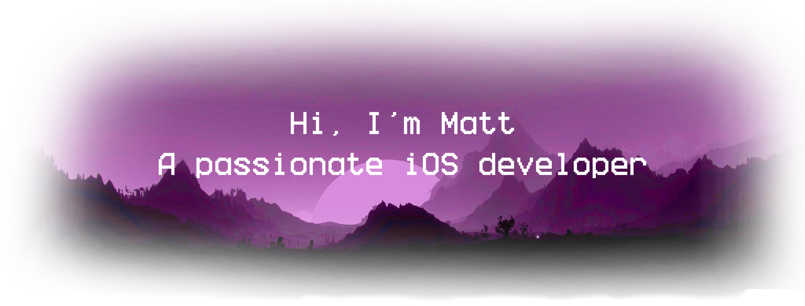
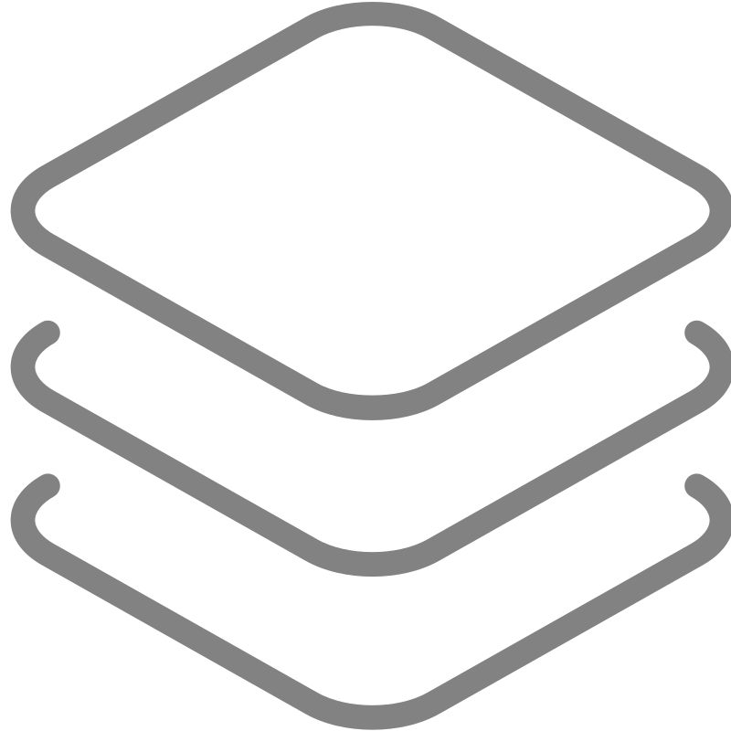
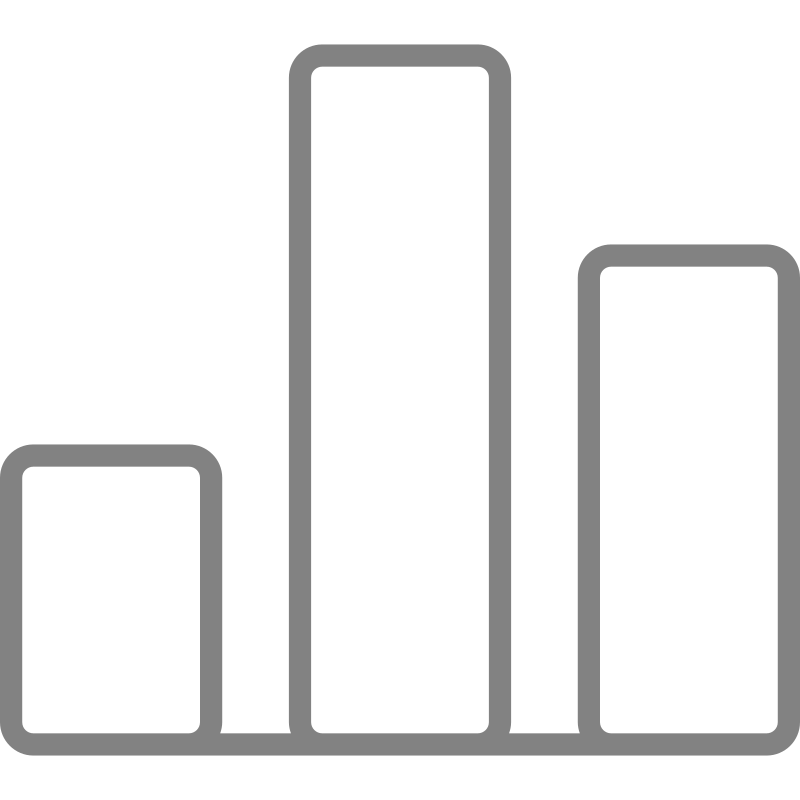

<header  style="font-family: Ubuntu">

I develop mobile applications for iOS platform. Creator of [Coda](https://github.com/MatoiDev/Coda) mobile messenger for Novgorod State University. I write both in Objective-C and Swift (I also know SwiftUI well enough to hate it). Constantly improving in ios development, I believe that knowledge is power.

Hobbyist ESP-family microcontroller developer. I like to create robots with CV, airplane-type FPV drones, and all sorts of little things like Hot Wheels RC car. Of course, I [combine](https://github.com/MatoiDev/Keira) this hobby with iOS development.

Current iOS Tweaks developer. My favourite hobby. I like to customise my phone, sometimes I share my stuff with the GitHub community, check out [Violet](https://github.com/MatoiDev/Violet) and [Notifake](https://github.com/MatoiDev/Notifake).

$$\text{Life}=\int_{\text{birth}}^{\text{death}}\frac{\text{ Code}}{\text{time}}\Delta\text{time}$$

</header>

<h2 align="center" style="font-weight: bold; font-family: Ubuntu">
    Technology Stack
    
</h2>

####  <header style="font-weight: bold; font-family: Ubuntu"> Languages <header/>

#### <header style="font-weight: bold; font-family: Ubuntu"> Platforms <header/>

####  <header style="font-weight: bold; font-family: Ubuntu"> Tools <header/>

<h2 align="center" style="font-weight: bold; font-family: Ubuntu">
    My Github Stats
    
</h2>

 

    
    

 

    

